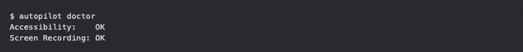
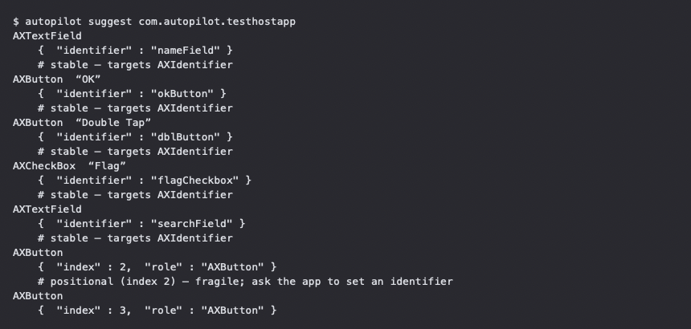
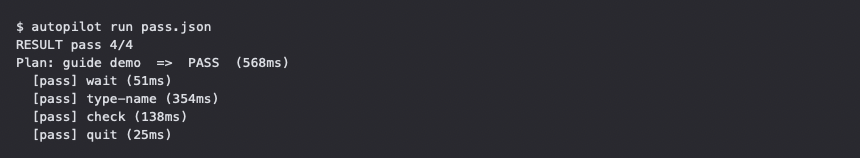
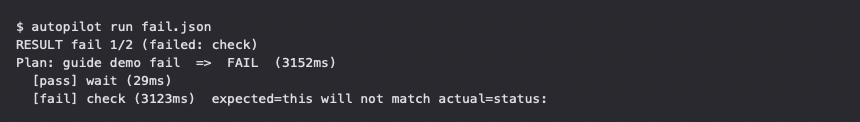
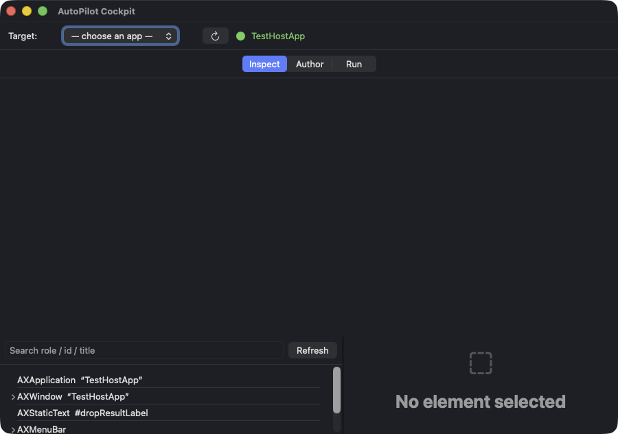
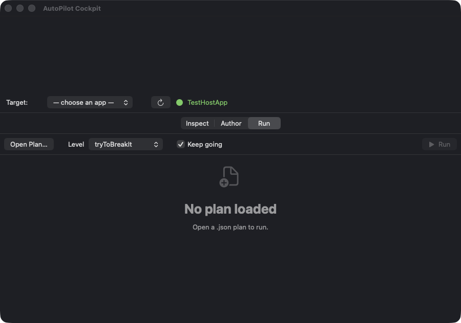
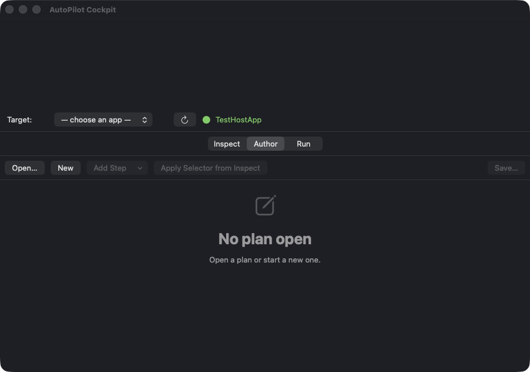

# AutoPilot User Guide

An illustrated walkthrough of AutoPilot — the command-line tool and the Cockpit
GUI. For the exhaustive reference, see the [User Manual](MANUAL.md) and
[Authoring Guide](AUTHORING.md); this guide shows the tool *in action*.

Screenshots in this guide were captured against **TestHostApp**, AutoPilot's own
test-fixture app, so nothing here depends on a specific third-party app.

---

## Part 1 — The command line

AutoPilot has no window of its own: it *drives other apps* through the macOS
Accessibility API and reports what happened on your terminal. The screenshots
below show the four commands you'll use most.

### 1.1 `autopilot doctor` — check permissions first

Before anything else, confirm the process running AutoPilot has the permissions it
needs. `doctor` checks Accessibility (required) and Screen Recording (needed only
for screenshots) and exits non-zero if something's missing.

```bash
autopilot doctor
```


<!-- SCREENSHOT: cli-doctor.png — terminal running `autopilot doctor` against a
     machine where Accessibility is granted. Show the full output including the
     permission lines and the exit summary. Terminal window only. -->

### 1.2 `autopilot suggest` / `dump-axtree` — find what to target

You write a plan by naming UI elements. `suggest` proposes a stable selector for
each interactive control; `dump-axtree` prints the full accessibility tree when you
need the complete picture (use `--under-role AXWindow --omit-menubar` to trim it).

```bash
autopilot suggest com.autopilot.testhostapp
autopilot dump-axtree com.autopilot.testhostapp --under-role AXWindow --omit-menubar
```


<!-- SCREENSHOT: cli-suggest.png — terminal running `autopilot suggest` against the
     running TestHostApp fixture, showing several suggested selectors (identifiers).
     Terminal window only. -->

### 1.3 `autopilot run` — drive a plan

`run` executes a JSON plan against the app and prints a per-step pass/fail summary.
Each line shows the step id, outcome, and duration.

```bash
autopilot run my-plan.json
```


<!-- SCREENSHOT: cli-run.png — terminal running `autopilot run` on a small fixture
     plan that PASSES, showing the "RESULT pass N/N" line and the per-step [pass]
     list with durations. Terminal window only. -->

### 1.4 A failing run — the artifact bundle

When a step fails, AutoPilot writes a failure screenshot and an AX-tree dump next to
the report so you can see *why* — the expected vs. actual value is printed inline.


<!-- SCREENSHOT: cli-run-fail.png — terminal running `autopilot run` on a plan with
     one deliberately-wrong assertion, showing the [fail] line with expected=/actual=.
     Terminal window only. -->

---

## Part 2 — The Cockpit GUI

`AutopilotCockpit.app` is a visual companion for the CLI. It drives apps through the
**same engine**, so anything you build in the Cockpit runs identically under
`autopilot run`. Launch it from `/Applications` (or wherever Homebrew installed it)
and grant it Accessibility permission the first time.

The window has a **mode switcher** at the top — **Inspect · Author · Run** — and a
shared **target bar** for choosing the app to drive.


<!-- SCREENSHOT: cockpit-overview.png — the AutopilotCockpit app window, Inspect mode,
     with the mode switcher and target bar visible, attached to TestHostApp.
     Cockpit window only (frontmost). -->

### 2.1 Inspect — browse the accessibility tree

Inspect shows the target app's live AX tree as an outline. Select a node to see its
role, identifier, title, value, and frame — and copy a ready-to-use selector for it.


<!-- SCREENSHOT: cockpit-inspect.png — Cockpit in Inspect mode, TestHostApp attached,
     the AX tree expanded with one node selected and its detail (role/identifier/
     value/frame) shown in the detail pane. Cockpit window only. -->

### 2.2 Run — drive a plan and watch it live

**Open Plan…** loads a `.json` plan; the **Level** picker sets the coverage tier
(happyPath / integrationSuite / tryToBreakIt) and **Keep going** controls whether a
failure stops the run. Press **Run** and each step lights up ⬜ pending → ▶ running →
✅ / ❌ as it executes, with its screenshot and AX-dump artifacts shown when you
select it.


<!-- SCREENSHOT: cockpit-run.png — Cockpit in Run mode, attached to TestHostApp,
     showing the Run controls (Open Plan…, Level, Keep going, Run). Cockpit window
     only. -->

### 2.3 Author — build a plan visually

**New** starts a plan and **Add Step** appends steps; you edit each step's action,
selector, and assertion, then **Save…** writes valid JSON. **Apply Selector from
Inspect** fills a step's target from the node you selected in Inspect — the key
cross-panel shortcut, so you never hand-write a selector.


<!-- SCREENSHOT: cockpit-author.png — Cockpit in Author mode, attached to TestHostApp,
     showing the authoring toolbar (Open…, New, Add Step, Apply Selector from Inspect,
     Save…). Cockpit window only. -->

---

## Where to go next

- **[User Manual](MANUAL.md)** — the full guide: installation, every action,
  assertions, selectors, suites, the MCP server, troubleshooting.
- **[Authoring Guide](AUTHORING.md)** — the complete action / selector / assertion
  reference, including the `exec` shell step (§5a) and the AppKit→AX cheat sheet.
- **Plan JSON schema** — [`schema/plan.schema.json`](../schema/plan.schema.json) for
  editor autocomplete and validation.
